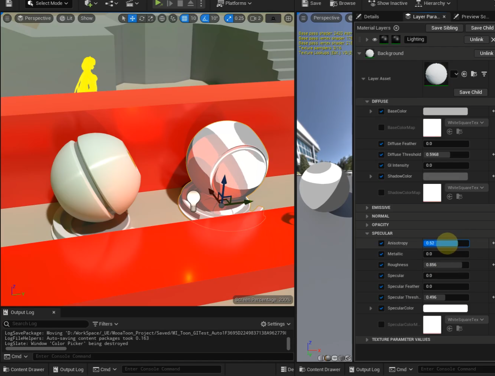

# MooaToon

[中文](https://github.com/JasonMa0012/MooaToon/blob/main/README_CN.md) | English

Mooatoon is a Toon Rendering Pipeline that supports  UE5 lighting system for **Movie**.

In development, please **Watch** this repo to get the latest news.

# Features

- Full support for **Lumen**

  - GI

  - Reflection

- Full support for **Shadow**

  - Virtual Shadow Map
  - Ray Tracing Shadow

- Partial support for **Translucency**

  - Forward Shading（Lit Transparent）
  - Dither Opacity
  - (TODO) Translucency Shadow

- Great flexibility, with the Material Layer you can freely combine and create materials that contain the following features

  - **Japanese animation style**, mainly pure color fast, clear light and shadow, often used to restore animation and hand-painted effect
  - **American cartoon style**, usually with GI, with a softer shading
  - Customizable base color, shadow color, highlight color
  - Customizable **light and shadow ranges**, transitions, (TODO) support **Ramp**
  - Customizable **highlight range, transition**, support **anisotropic highlights**
  - (TODO) Customizable the range of **shadows cast and accepted**
  - (TODO) **Rimlight** based on NoV or Screen Space Depth
  - (TODO) **Hair Shadow** based on Screen Space Depth
  - (TODO) **Face Shadow** based on Vertex Normal, Normal Map, Spherical Mapping, or any other method
  - Free to create and modify any features you need in the material editor

- (TODO) **Back Face Outline**, **Geometry Outline**, and other methods

- (TODO) Movie post effect support

  - Correct **automatic exposure and manual exposure**
  - Globally controlled exposure compensation
  - Globally controlled Saturation, Contrast and other adjustments
  - **LookDev** support

Video：

https://www.bilibili.com/video/BV1m34y1V7MV

