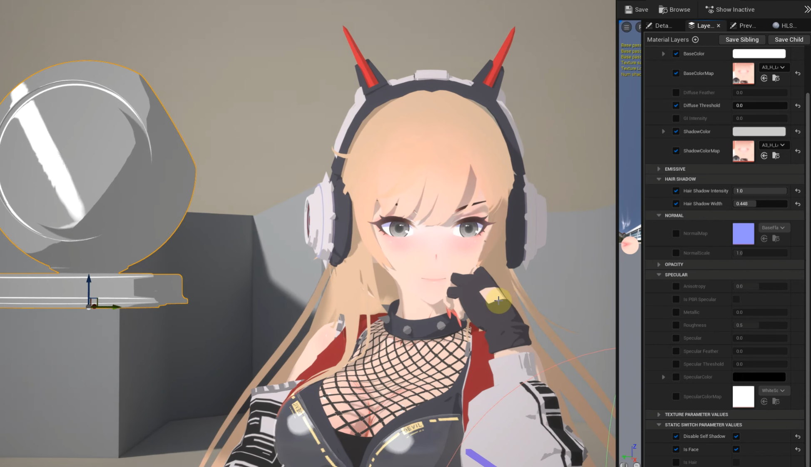

# MooaToon

[中文](https://github.com/JasonMa0012/MooaToon/blob/main/README_CN.md) | English

**MooaToon** is a plugin that aims to completely solve the shortcomings of UE5 **Toon Rendering**, combining UE5 built-in **Lighting Features** with a **Powerful Material System** to unlock the potential of artists.

In development, please **Watch** this repo to get the latest news.

# Features

- Full support for **Lumen**

  - Free to control **GI Intensity and Blending**

  - Free to control **Reflection Intensity**
- Full support for **Shadow**

  - Virtual Shadow Map
  - Ray Tracing Shadow
    - Support for ignoring arbitrary partial **Self-Shadow**
    - Support for controllable **Hair Shadow Width**
- Partial support for **Translucency**

  - Forward Shading（Lit Transparent）
  - Dither Opacity
  - (TODO) Translucency Shadow
- Great flexibility, with the Material Layer you can freely combine and create materials that contain the following features

  - **Japanese animation style**, mainly pure color fast, clear light and shadow, often used to restore animation and hand-painted effect
  - **American cartoon style**, usually with GI, with a softer shading
  - Customizable base color, shadow color, highlight color
  - Customizable **light and shadow ranges**, transitions, (TODO) support **Ramp**
  - Customizable **highlight range, transition**, support **anisotropic highlights**
  - (TODO) **Rimlight** based on NoV or Screen Space Depth
  - (TODO) **Face Shadow** based on Vertex Normal, Normal Map, Spherical Mapping, or any other method
  - Free to create and modify any features you need in the material editor
- (TODO) **Back Face Outline**, **Geometry Outline**, and other methods
- Cinematic post effect support

  - Correct **automatic exposure and manual exposure**
  - Globally controlled exposure compensation
  - Globally controlled Saturation, Contrast and other adjustments
  - **LookDev** tool support

Videos：

Models: KAGAMI Ⅱ WORKs, VRM4U

https://www.bilibili.com/video/BV1eG4y1x7Fr/

https://www.youtube.com/watch?v=oBibO0WlakE

https://www.bilibili.com/video/BV1m34y1V7MV

