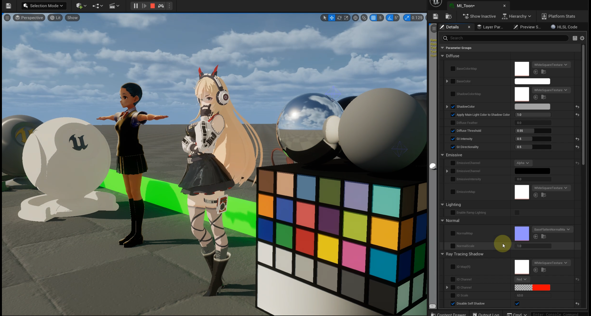

# MooaToon

- [Features](#features)
- [Works](#works)
  * [Videos](#videos)
  * [Articles](#articles)
- [License](#license)
  * [Commercial Activities](#commercial-activities)
  * [Modify and Republish](#modify-and-republish)
- [Wiki](#wiki)
- [References](#references)

[中文](https://github.com/JasonMa0012/MooaToon/blob/main/README_CN.md) | English

**MooaToon** is a plugin that aims to completely solve the shortcomings of **UE5 Toon Rendering**, combining UE5 built-in **Lighting Features** with a **Powerful Material System** to unlock the potential of artists.

**Note**: MooaToon is still in preview and the design is subject to change at any time. Please do not modify the MooaToon file directly, otherwise the changes will be lost during the update.

**Important Note**: MooaToon is currently prohibits commercial activities prior to obtaining a License. For details, please read **License**.

Please **Watch** this repository or join social media for the latest news:

- Discord: https://discord.gg/Bu2DUCwyXK
- Twitter: https://twitter.com/JasonMa0012
- Youtube: https://www.youtube.com/@jasonma0012
- QQ 群: 707889886
- 知乎: https://www.zhihu.com/people/blackcat1312
- Bilibili: https://space.bilibili.com/42463206

## Features

- **Platforms**
	- PC
- **Lumen**
  - Free to control **GI Intensity and Blending**

  - Free to control **Reflection Intensity**

- **Shadow**
  - Virtual Shadow Map
  - Ray Tracing Shadow
    - Support for ignoring arbitrary partial **Self-Shadow**
    - Support for controllable **Hair Shadow Width**
- **Translucency**
  - Forward Shading (Lit Transparent)
  - Dithered Opacity
  - Dithered **Translucency Shadow**
- Great flexibility, with the Material Layer you can freely combine and create materials that contain the following features

  - **Japanese Animation style**, mainly pure color fast, clear light and shadow, often used to restore animation and hand-painted effect
  - **American Cartoon style**, usually with GI, with a softer shading
  - Customizable Base Color, Shadow Color, Specular Color
  - Customizable **Light and Shadow Range**, (TODO) support **Ramp Map**
  - Customizable **Highlight Range**, support **Anisotropic Highlight**
  - **Per Light** Screen Space Depth Test **Rimlight**
  - **Face Shadow** based on Spherical Mapped Vertex Normal, Normal Map, or other method
  - Free to create and modify any features you need in the material editor
- Outline by single Overlay Material
  - Traditional **Back Face Outline**
  - Screen Space Depth Normal Convolution based **Front Face Outline**
  - Output Velocity to use with TSR **Anti-Aliasing**
  - One-Click baking tool for Smooth Normal
  - Houdini sample file for handling normals and vertex colors

- Cinematic post effect support

  - Correct **automatic exposure and manual exposure**
  - Globally controlled exposure compensation
  - Globally controlled Saturation, Contrast and other adjustments
  - **LookDev** tool
- Misc
  - Morph Targets Normal Intensity

## Works

### Videos

| Title                                                        | Link                                        | Description                   |
| ------------------------------------------------------------ | ------------------------------------------- | ----------------------------- |
| 【Mooa Toon Devlog UE5.1】Toon Rendering with Lumen, Time of Day | https://www.youtube.com/watch?v=u0neEKu3zbQ | Models：KAGAMI Ⅱ WORKs, VRM4U |
|  |                                             |                               |
| 【Mooa Toon Devlog】UE5 Ray Tracing Toon Hair Shadow \| Multi-light Interaction | https://www.youtube.com/watch?v=oBibO0WlakE | Model：KAGAMI Ⅱ WORKs         |
|  |                                             |                               |
| MooaToon Devlog：Toon Rendering Pipeline for UE5             | https://www.youtube.com/watch?v=_BejvAj7L4g | Model：KAGAMI Ⅱ WORKs         |
|  |                                             |                               |
|                                                              |                                             |                               |
|                                                              |                                             |                               |
|                                                              |                                             |                               |

### Articles

|      |      |      |
| ---- | ---- | ---- |
|      |      |      |

## License

The following is a simple user license agreement (hereinafter referred to as the "Agreement"), which may be updated at any time. Please **Watch** this repository for updates. By continuing to use MooaToon, you are deemed to have understood and agreed to this Agreement. If you use and violate the terms of this Agreement, we reserve the right to hold you accountable at any time.

MooaToon consists of the following parts:

1. "Engine Modifications": refers to the portion created by Epic Games and modified by Jason Ma, i.e. the files with content modifications obtained through branch comparison with Epic Games
2. "Plugin Content": refers to the files created by Jason Ma, including but not limited to:
   1. Engine branch: Engine/Plugins/MooaToon
   2. Other Non-Third-Party added files in the Engine branch
   3. Non-Third-Party content in the Project branch
3. "Rendering Technology": refers to the technical concept of "Engine Modifications" and "Plugin Content" designed by Jason Ma and completed based on this guidance.

For Engine Modifications, we follow the "Epic Agreement" (https://www.unrealengine.com/eula). For Plugin Content and Rendering Technology, we have the following restrictions based on the Epic Agreement:

### Commercial Activities

**You are prohibited from engaging in any commercial activities using MooaToon without our special permission**. You can contact jasonma0012@foxmail.com for inquiries about commercial licensing.

**In addition, you can use MooaToon for any activities other than commercial purposes, but you will have to bear all consequences on your own**.

### Modify and Republish

**You can freely modify MooaToon, but public redistribution is prohibited**.

It is also prohibited to change the engine modifications or plugin content in a way that almost does not change the rendering technology in order to circumvent this agreement.

In addition, you can participate in the development of MooaToon, please contact jasonma0012@foxmail.com for inquiries.

## Wiki

https://github.com/JasonMa0012/MooaToon/wiki

## References

| Name      | Author    | Link                                                  |
| --------- | --------- | ----------------------------------------------------- |
| VRM4U     | ruyo      | https://github.com/ruyo/VRM4U                         |
| UnityChan | © UTJ/UCL | https://unity-chan.com/                               |
| github_ip | Boran Li  | https://github.com/12218/python/tree/master/github_ip |

